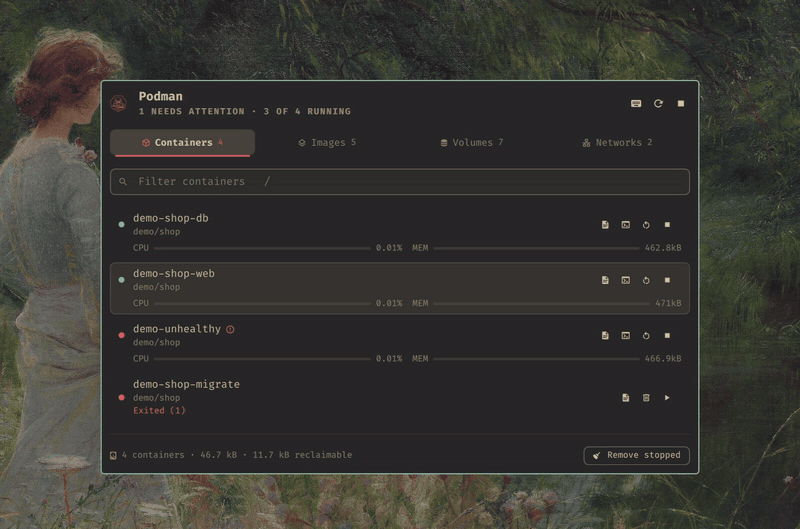

# nixarchy.podman

A native Podman manager for the [Omarchy](https://omarchy.org/) shell, packaged for NixOS
and [nixarchy](https://github.com/olafkfreund/nixarchy).

**[See it in action →](https://olafkfreund.github.io/nixarchy-podman/)** — the showcase site, with the full tour.



Containers, images, volumes and networks on four tabs, without opening a terminal and
without reaching for the mouse if you would rather not. There are two ways in, with the
same tabs and the same keys (new here? start with [the usage guide](docs/usage.md)):

- **The bar popup.** Click the Podman glyph in the bar. The glyph brightens while
  something is running and turns red when a container needs attention.
- **The full-screen menu.** Pick **Podman** in the Omarchy menu (Super+Alt+Space), or
  press your own bind. It is larger, holds the keyboard while it is up, and does not need
  the widget to be in the bar.

This is a fork of [OmaPodman](https://github.com/i228808/omapodman) by Abdullah Mansoor,
itself a Podman port of [OmaDocker](https://github.com/kayooliveira/omadocker). The fork
adds the flake, the menu surface, and a fix so Podman failures show as errors instead of
an empty list.

## What it does

**Containers** — grouped by Compose project, running first, with live CPU and memory for
each one. Start, stop and restart a single container or a whole project; follow its logs or
drop into a shell inside it; a red dot and a warning glyph call out anything unhealthy,
crash-looping, or that exited badly.

**Images · Volumes · Networks** — each tab splits into **Unused** and **In use**, biggest
first, so what is costing you disk is the first thing you see. Podman itself decides what
counts as unused, so the list agrees with what `prune` would actually take.

**Reclaiming space** — the footer says what the current tab holds and how much of it is
reclaimable, straight from `podman system df`. One button — or the `p` key — prunes it, and
always asks first, naming exactly what is about to go.

**Getting out of your way when it goes wrong** — Podman refuses plenty of reasonable-looking
requests ("volume is being used", "image is in use"). It shows you Podman's reason
verbatim instead of failing silently.

## Keyboard

Everything in both surfaces is reachable from the keyboard, with the same keys. Press `?`
inside either for this same list.

### Moving around

| Key | Does |
| --- | --- |
| `1` – `4` | Jump straight to a tab |
| `h` `l` · `←` `→` | Previous / next tab |
| `j` `k` · `↑` `↓` | Move the cursor down / up |
| `/` | Jump into the filter box |
| `k` `↑` | From the first row, step back up into the filter |
| `esc` | Leave the filter, then close the panel |
| `tab` | Next bar panel, from the popup; next tab, in the full-screen menu |

### Containers

| Key | Does |
| --- | --- |
| `enter` | Start or stop the container |
| `r` | Restart it |
| `o` | Follow its logs in a terminal |
| `s` | Open a shell inside it |
| `n` | Copy its name |

### Cleaning up

| Key | Does |
| --- | --- |
| `x` | Remove whatever the cursor is on (on an image row, that tag) |
| `p` | Prune everything unused on this tab |

Both always ask first.

### The panel itself

| Key | Does |
| --- | --- |
| `c` | Copy the id, or a volume's mount path |
| `enter` | Copy, on the image, volume and network tabs |
| `u` | Refresh now |
| `d` | Open podman-tui |
| `?` | Show the shortcut sheet |

Clicking works everywhere too: a row copies its identifier, the buttons at its right edge do
what their tooltips say, and a project header starts or stops the whole project.

## Installation

On NixOS with nixarchy, add the flake as an input and install the plugin next to
`programs.nixarchy.enable`:

```nix
inputs.nixarchy-podman = {
  url = "github:olafkfreund/nixarchy-podman";
  inputs.nixpkgs.follows = "nixpkgs";
};

programs.nixarchy.plugins."nixarchy.podman".src =
  inputs.nixarchy-podman.packages.${pkgs.stdenv.hostPlatform.system}.default;
virtualisation.podman.enable = true;
```

Rebuild, then run `omarchy plugin enable nixarchy.podman` once; that also places the
widget in the bar. Without Nix, run `omarchy plugin add
https://github.com/olafkfreund/nixarchy-podman` and then enable it the same way.

**[The usage guide](docs/usage.md)** covers the rest:

- the requirements;
- adding Podman to the Omarchy menu and binding Super+Alt+O;
- moving from OmaPodman;
- troubleshooting;
- removal.

## Settings

Everything below is per-instance, set with `omarchy bar set nixarchy.podman <key> <value> --json`
(it edits `shell.json`; see [the manual](docs/usage.md#settings)).

| Setting | Default | What it changes |
| --- | --- | --- |
| Refresh interval | `15s` | How often the bar glyph re-reads Podman. The open panel refreshes every 3 seconds regardless. |
| Tab the panel opens on | `Containers` | Where the panel lands every time it opens. |
| Show stopped containers | on | Off lists only what is running. |
| Show CPU and memory | on | Off skips `podman stats` entirely — worth it on a laptop. |
| Measure what each volume costs | on | Off keeps the volume list instant and leaves per-volume sizes blank. The reclaimable total still works. |
| Hide the bar icon when empty | off | On removes the button until the Containers tab lists at least one container. |

The full-screen menu reads the same settings from the bar widget's entry each time it
opens. The one exception is hiding the bar icon, which has no meaning in the menu.

## IPC

```bash
omarchy-shell shell toggle nixarchy.podman '{}'     # the full-screen menu
omarchy shell nixarchy.podman.bar toggle            # the bar popup
omarchy shell nixarchy.podman.bar tab volumes
omarchy shell nixarchy.podman.bar refresh
omarchy shell nixarchy.podman.bar stopAll
```

With several monitors, the bar popup's IPC target reaches one monitor's bar only. Use
the menu for a key bind.

## Notes on the Docker → Podman port

Podman's own JSON output (`--format '{{json .}}'`) does not look like Docker's: `Names` and
`Ports` come back as arrays, `Labels` as an object, and the human-readable status string
("Up 2 hours (healthy)") is not in it at all — the JSON `Status` field only carries health
state. OmaPodman works around this with custom Go templates (`--format '{"ID":{{json
.ID}},...}'`) that ask Podman's own template functions for each field individually, which
hands back exactly the flattened, Docker-shaped strings the rest of the code expects. This
also means Podman decides everything the panel shows — running state, health, what counts
as unused — the same way it decided for Docker; the templates are just an adapter.

A couple of things are genuinely different rather than merely reformatted:

- `podman system df -v` refuses to run with `--format`, so per-volume sizes are read from
  its plain text table instead of JSON.
- Podman does not list `host` or `none` as removable network objects the way Docker does;
  only its own default `podman` bridge network is protected from removal.
- Rootless Podman needs no daemon and no group membership, so there is no equivalent of
  Docker's `sudoless-docker` setup step.

## Development

```bash
nix flake check   # the Model tests, plus the plugin's shape
nix build         # the plugin folder, exactly as nixarchy links it
```

`nix flake check` runs the Model tests and checks the plugin's shape: the manifest and
its entry points, no symlinks, no pacman/yay, and no hardcoded colours. To iterate on a
live shell, link the checkout into place and restart the shell:

```bash
ln -s "$PWD" ~/.config/omarchy/plugins/nixarchy.podman
omarchy-restart-shell
```

Everything that is not drawing lives in `Model.js`: parsing Podman's output, deciding what
is unused, sorting, sectioning, building rows and commands, and reading the menu's
settings. It is a plain `.pragma library` that runs under Node:

```bash
node tests/run.js
```

The QML:

| File | Role |
| --- | --- |
| `PodmanState.qml` | Data, polling and every Podman command. One per surface; it polls only while its surface is open (the bar also keeps a slow poll for its glyph). |
| `PodmanView.qml` | Tabs, cursor, filter, confirmations, keys. Shared by both surfaces. |
| `Panel.qml` | The bar widget: glyph plus popup. |
| `Menu.qml` | The full-screen menu. |
| `TabStrip.qml` | The tab bar. |
| `ResourceList.qml` | The rows of the current tab. |
| `ShortcutSheet.qml` | The `?` overlay. |

Changes go through `intent/`, `spec/` and `plan/`, as in the other nixarchy plugins. AI agents
(and people) working on the code should read [AGENTS.md](AGENTS.md) first: the layout,
commands, live-testing steps and the rules this repo has learned the hard way.

## License

MIT. See [LICENSE](LICENSE). OmaPodman is by Abdullah Mansoor.
