Podman for the [Omarchy](https://omarchy.org) shell on
[nixarchy](https://olafkfreund.github.io/nixarchy/): your containers, images, volumes
and networks on the bar and on a key.

<figure class="shot">
  <video controls autoplay muted loop playsinline preload="metadata" aria-label="Recording of the full-screen Podman menu stopping a container">
    <source src="img/rec-menu.webm" type="video/webm">
    <source src="img/rec-menu.mp4" type="video/mp4">
  </video>
  <figcaption>The full-screen menu, driven from the keyboard: <kbd>j</kbd> to a container, <kbd>enter</kbd> to stop it, and it drops to the bottom as it stops.</figcaption>
</figure>

## Who it is for

You run containers with rootless Podman on an Omarchy desktop: a database for the
project you are on, a few services you started last month, and images you pulled once
and forgot. You would rather glance at your bar than type `podman ps -a`.

## The problem

Four questions come up all the time: *What is running? What is broken? What is eating
my disk? Is it safe to delete?* Each needs its own command, and they don't talk to each
other:

```
podman ps -a            # what is running, what exited
podman images           # what is taking space
podman volume ls        # which of these is still attached to anything?
podman system df -v     # how much would I get back?
podman volume prune     # and this one you cannot take back
```

So you run them in a terminal, read the output side by side, and either decide it is
not worth the risk or delete something you needed.

## What it does

**One glyph in the bar** tells you the state at a glance. It is dim when nothing runs,
bright when something does, and red when a running container is unhealthy or stuck
restarting.

<figure class="shot">
  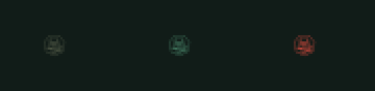
  <figcaption>The glyph, enlarged: dim (nothing running), accent (running), red (a running container is unhealthy or restarting).</figcaption>
</figure>

**Four tabs** answer the four questions. Containers are grouped by Compose project,
running first, with live CPU and memory. Images, volumes and networks are each split
into **Unused** and **In use**, biggest first, and the footer says how much you would
get back.

<div class="shot-pair">
<figure class="shot">
  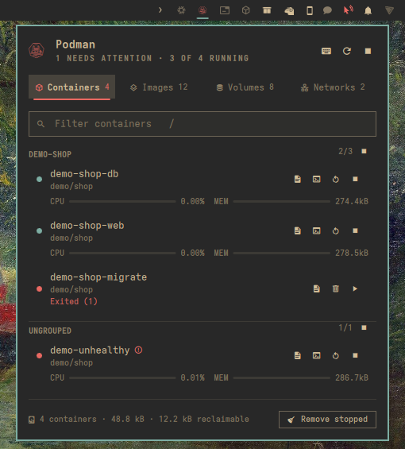
  <figcaption><kbd>1</kbd> Containers, grouped by project, with live CPU and memory. The failed one-off job shows its exit code.</figcaption>
</figure>
<figure class="shot">
  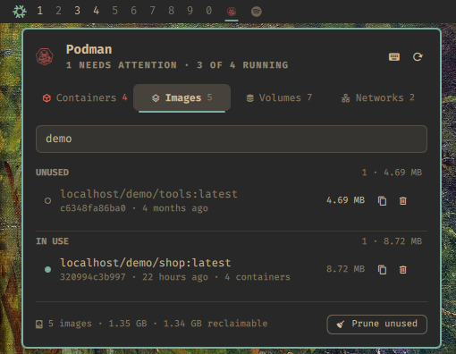
  <figcaption><kbd>2</kbd> Images: Unused above In use, and the footer says what you would get back.</figcaption>
</figure>
</div>
<div class="shot-pair">
<figure class="shot">
  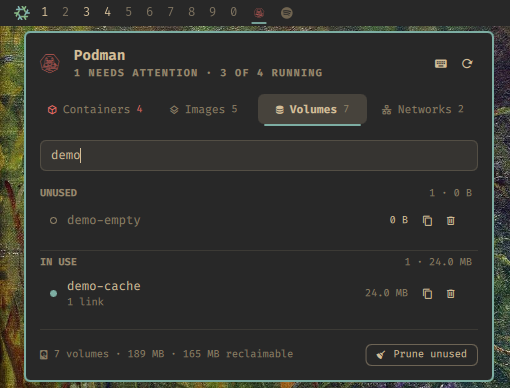
  <figcaption><kbd>3</kbd> Volumes, with what each one costs on disk.</figcaption>
</figure>
<figure class="shot">
  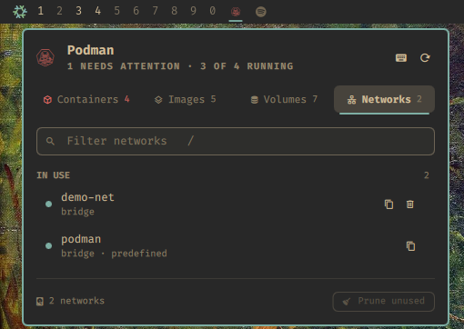
  <figcaption><kbd>4</kbd> Networks. Podman's own <code>podman</code> network is marked predefined and cannot be removed.</figcaption>
</figure>
</div>

**Every action is a key.** Start, stop and restart. Follow the logs, or open a shell
inside a container. Copy a name or an id. Remove one thing, or prune a whole tab.

**There are two ways in.** Click the glyph for a popup under it, or press
<kbd>Super</kbd>+<kbd>Alt</kbd>+<kbd>O</kbd> (or pick **Podman** in the Omarchy menu)
for a larger full-screen view. The full-screen view holds the keyboard until you are
done, and does not need the widget to be in the bar at all.

<figure class="shot">
  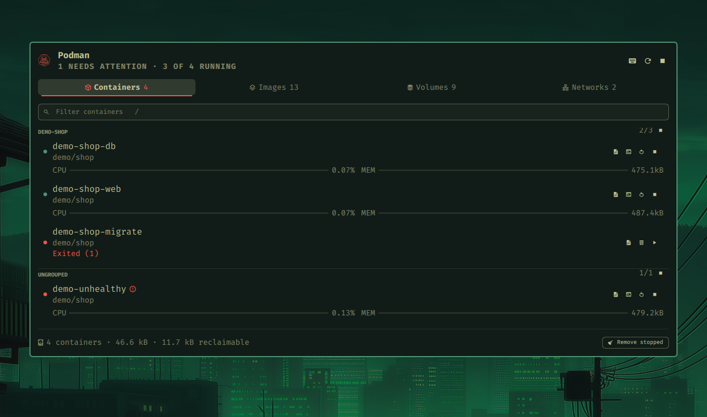
  <figcaption>The full-screen menu over your desktop: the same tabs, drawn larger, holding the keyboard.</figcaption>
</figure>
<figure class="shot">
  <video controls autoplay muted loop playsinline preload="metadata" aria-label="Recording of opening Podman from the Omarchy menu">
    <source src="img/rec-omarchy-menu.webm" type="video/webm">
    <source src="img/rec-omarchy-menu.mp4" type="video/mp4">
  </video>
  <figcaption>From the Omarchy menu: search <em>podman</em>, pick <strong>Podman</strong>.</figcaption>
</figure>

## How it works

- **Podman decides, not the plugin.** What counts as unused, how much a volume takes and
  what a prune would remove all come from Podman's own answers. So the Unused list is
  exactly what `prune` would take.
- **Nothing irreversible happens by accident.** <kbd>x</kbd> and <kbd>p</kbd> always ask
  first, say what is about to go, and have **Cancel** selected.
- **When Podman says no, you see why.** Podman refuses plenty of reasonable-looking
  requests: a volume still mounted, an image still in use. Its own reason appears under
  the list, verbatim.
- **It stays out of the way.** A closed surface does nothing. The only background work
  is a slow check that keeps the glyph honest.

<div class="shot-pair">
<figure class="shot">
  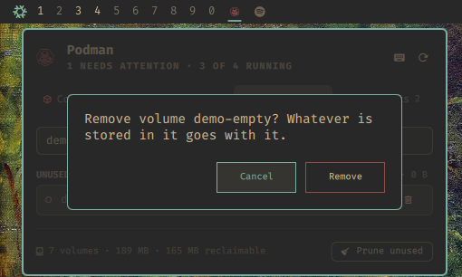
  <figcaption><kbd>x</kbd> asks, names the item, and has Cancel selected.</figcaption>
</figure>
<figure class="shot">
  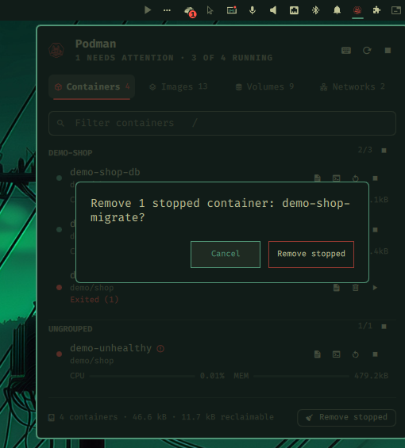
  <figcaption><kbd>p</kbd> says exactly what kind of thing goes, and has Cancel selected.</figcaption>
</figure>
</div>
<figure class="shot">
  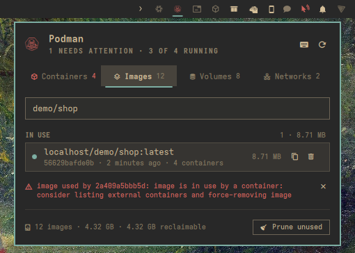
  <figcaption>Removing an image a container still uses: the question warns Podman will refuse, and when it does, its own reason is shown.</figcaption>
</figure>

## Why it is built this way

- **Podman's judgment, not a guess.** A tool that re-implements "unused" gets it wrong
  eventually, and for a delete key, wrong is expensive.
- **Keyboard first.** Omarchy is a keyboard desktop, and a container manager you have
  to reach for the mouse to use would not get used. Every surface, tab, row and action
  has a key; press <kbd>?</kbd> for all of them.
- **No daemon, no wrapper.** It runs `podman` from your `PATH`, rootless, as you. There
  is nothing extra to keep running or to trust.
- **Installed like the rest of nixarchy.** It is a flake. Your system configuration
  says it is there, and a rebuild puts it there.

## A tour

<figure class="shot">
  <video controls autoplay muted loop playsinline preload="metadata" aria-label="Recording of the bar popup">
    <source src="img/rec-popup.webm" type="video/webm">
    <source src="img/rec-popup.mp4" type="video/mp4">
  </video>
  <figcaption>The bar popup: the cursor, a filter, jumping to Networks and back, and the shortcut sheet.</figcaption>
</figure>
<div class="shot-pair">
<figure class="shot">
  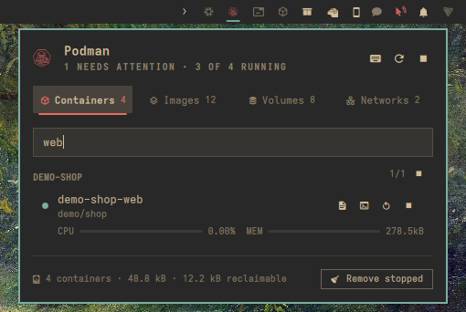
  <figcaption><kbd>/</kbd> filters the tab as you type.</figcaption>
</figure>
<figure class="shot">
  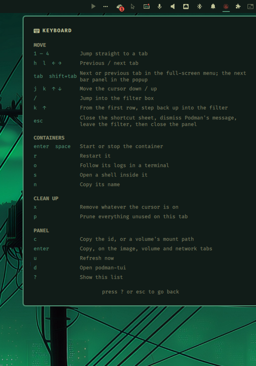
  <figcaption><kbd>?</kbd> lists every key.</figcaption>
</figure>
</div>
<figure class="shot">
  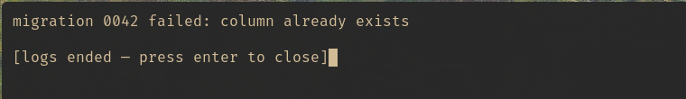
  <figcaption><kbd>o</kbd> follows a container's logs in a terminal. Here, why the migration job failed.</figcaption>
</figure>
<figure class="shot">
  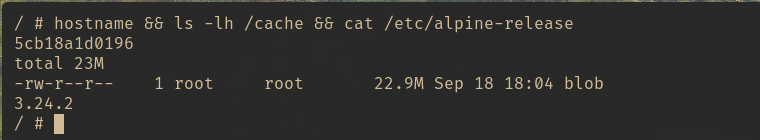
  <figcaption><kbd>s</kbd> opens a shell inside a running container.</figcaption>
</figure>
<figure class="shot">
  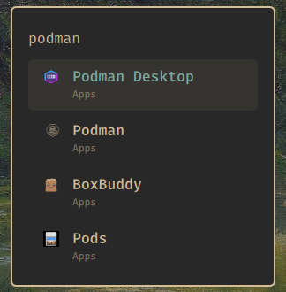
  <figcaption>The <strong>Podman</strong> row in the Omarchy menu, from <code>share/omarchy-menu.jsonc</code>.</figcaption>
</figure>

## Install

On NixOS with nixarchy, add the flake and install the plugin next to
`programs.nixarchy.enable`:

```nix
inputs.nixarchy-podman = {
  url = "github:olafkfreund/nixarchy-podman";
  inputs.nixpkgs.follows = "nixpkgs";
};

programs.nixarchy.plugins."nixarchy.podman".src =
  inputs.nixarchy-podman.packages.${pkgs.stdenv.hostPlatform.system}.default;
virtualisation.podman.enable = true;
```

Rebuild, then enable it once:

```
omarchy plugin enable nixarchy.podman
```

Without Nix: `omarchy plugin add https://github.com/olafkfreund/nixarchy-podman`, then
the same `enable`.

**[Read the manual](usage/)** for the Omarchy menu row, the key binding, settings,
troubleshooting and removal. The source is at
[github.com/olafkfreund/nixarchy-podman](https://github.com/olafkfreund/nixarchy-podman).

---

*Every image on this page is the real plugin on a real machine, driven from the
keyboard. It was captured with throwaway `demo-*` containers, volumes and networks,
which were removed afterwards. Nothing else on the machine was changed.*
